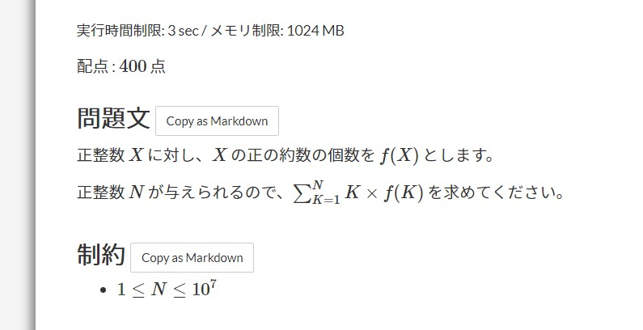

# atcoder-copy-as-markdown
AtCoderの問題と制約をMarkdown形式でクリップボードにコピーするユーザースクリプト

## 機能
問題文と制約の部分に表示されるボタンをクリックするとそれぞれの内容をMarkdown形式でクリップボードにコピーします。



コピーされた文字列の例
```markdown
正整数 $X$ に対し、$X$ の正の約数の個数を $f(X)$ とします。
正整数 $N$ が与えられるので、$\sum_{K=1}^N K\times f(K)$ を求めてください。
```

## インストール
1. Tampermonkey拡張機能をインストール
2. [atcoder-copy-as-markdown.user.js](https://github.com/na3shkw/atcoder-copy-as-markdown/raw/master/atcoder-copy-as-markdown.user.js)をRAWで開く
3. インストール
